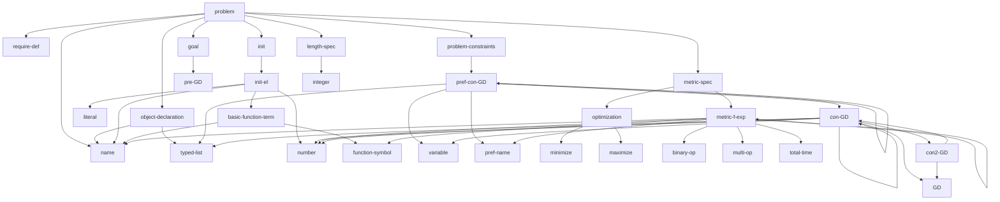

# BNF Elements

```mermaid
graph TD

%% Problem specification
    problem --> name
    problem --> require-def
    problem --> object-declaration
    problem --> init
    problem --> goal
    problem --> problem-constraints
    problem --> metric-spec
    problem --> length-spec
    
    object-declaration --> typed-list
    object-declaration --> name
    init --> init-el
    init-el --> literal
    init-el --> name
    init-el --> number
    init-el --> basic-function-term
    
    basic-function-term --> function-symbol
    basic-function-term --> name
    
    goal --> pre-GD
    
    problem-constraints --> pref-con-GD
    
    pref-con-GD --> pref-con-GD
    pref-con-GD --> variable
    pref-con-GD --> typed-list
    pref-con-GD --> pref-name
    pref-con-GD --> con-GD
    
    con-GD --> con-GD
    con-GD --> typed-list
    con-GD --> variable
    con-GD --> GD
    con-GD --> number
    
    metric-spec --> optimization
    metric-spec --> metric-f-exp
    
    optimization --> minimize
    optimization --> maximize
    
    metric-f-exp --> binary-op
    metric-f-exp --> metric-f-exp
    metric-f-exp --> multi-op
    metric-f-exp --> number
    metric-f-exp --> function-symbol
    metric-f-exp --> name
    metric-f-exp --> total-time
    metric-f-exp --> pref-name
    
    length-spec --> integer
    
    con-GD --> con2-GD
    con-GD --> number
    
    con2-GD --> con-GD
    con2-GD --> GD
```
