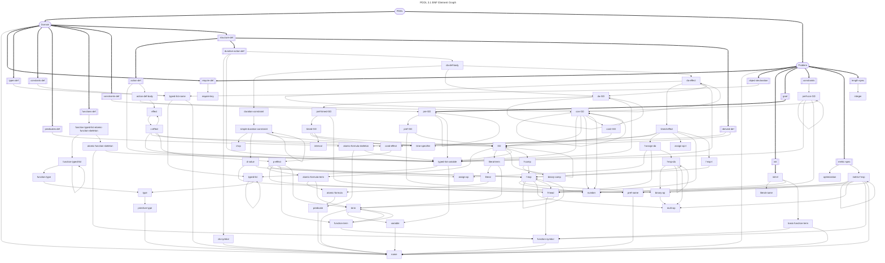

# BNF Elements

```mermaid
---
title: PDDL 3.1 BNF Element Graph
---
flowchart TD

    PDDL([PDDL])

    PDDL ==> domain([Domain])
    PDDL ==> problem([Problem])

%% Domain specification
    domain --> name
    domain ==> require-def[[require-def]]
    domain ==> types-def[[types-def]]
    domain ==> constants-def[[constants-def]]
    domain ==> predicates-def[[predicates-def]]
    domain ==> functions-def[[functions-def]]
    domain ==> domain-constraints[[constraints-def]]
    domain ==> structure-def[[structure-def]]
    
    require-def --> require-key
    
    types-def --> typed-list-name
    
    constants-def --> typed-list-name
    
    predicates-def --> atomic-formula-skeleton
    
    atomic-formula-skeleton --> predicate
    atomic-formula-skeleton --> typed-list-variable
    
    predicate --> name
    variable --> name
    
    atomic-function-skeleton --> function-symbol
    atomic-function-skeleton --> typed-list-variable
    
    function-symbol --> name
    
    functions-def --> function-typed-list-atomic-function-skeleton

    function-typed-list-atomic-function-skeleton --> function-typed-list
    function-typed-list-atomic-function-skeleton --> atomic-function-skeleton
    
    function-typed-list --> function-type
    function-typed-list --> function-typed-list
    
    function-type --> type
    
    domain-constraints --> con-GD
    
    structure-def ==> action-def[[action-def]]
    structure-def ==> durative-action-def[[durative-action-def]]
    structure-def ==> derived-def[[derived-def]]
    
    typed-list --> typed-list
    typed-list --> type

    typed-list-variable --> typed-list
    typed-list-variable --> variable

    typed-list-name --> typed-list
    typed-list-name --> name

    primitive-type --> name
    
    type --> primitive-type
    
    action-def --> typed-list-variable
    action-def --> action-def-body
    
    action-def-body --> pre-GD
    action-def-body --> effect
    
    pre-GD --> pref-GD
    pre-GD --> pre-GD
    pre-GD --> typed-list-variable
    
    pref-GD --> pref-name
    pref-GD --> GD
    
    pref-name --> name

    literal-term --> literal
    literal-term --> term

    atomic-formula-term --> atomic-formula
    atomic-formula-term --> term

    GD --> atomic-formula-term
    GD --> literal-term
    GD --> GD
    GD --> typed-list-variable
    GD --> f-comp
    
    f-comp --> binary-comp
    f-comp --> f-exp
    
    literal --> atomic-formula
    
    atomic-formula --> predicate
    
    term --> name
    term --> variable
    term --> function-term
    
    function-term --> function-symbol
    function-term --> term
    
    f-exp --> number
    f-exp --> binary-op
    f-exp --> f-exp
    f-exp --> multi-op
    f-exp --> f-head
    
    f-head --> function-symbol
    f-head --> term
    
    binary-op --> multi-op
    
    effect --> c-effect
    
    c-effect --> typed-list-variable
    c-effect --> effect
    c-effect --> GD
    c-effect --> cond-effect
    c-effect --> p-effect
    
    p-effect --> atomic-formula-term
    p-effect --> assign-op
    p-effect --> f-head
    p-effect --> f-exp
    p-effect --> function-term
    p-effect --> term

    cond-effect --> p-effect
    
    durative-action-def --> da-symbol
    durative-action-def --> typed-list-variable
    durative-action-def --> da-def-body
    
    da-symbol --> name
    
    da-def-body --> duration-constraint
    da-def-body --> da-GD
    da-def-body --> da-effect
    
    da-GD --> pref-timed-GD
    da-GD --> da-GD
    da-GD --> typed-list-variable
    
    pref-timed-GD --> timed-GD
    pref-timed-GD --> pref-name
    
    timed-GD --> time-specifier
    timed-GD --> GD
    timed-GD --> interval
    
    duration-constraint --> simple-duration-constraint
    
    simple-duration-constraint --> d-op
    simple-duration-constraint --> d-value
    simple-duration-constraint --> time-specifier
    simple-duration-constraint --> simple-duration-constraint
    
    d-value --> number
    d-value --> f-exp
    
    da-effect --> da-effect
    da-effect --> timed-effect
    da-effect --> typed-list-variable
    da-effect --> da-GD
    
    timed-effect --> time-specifier
    timed-effect --> cond-effect
    timed-effect --> f-assign-da
    timed-effect --> assign-op-t
    timed-effect --> f-head
    timed-effect --> f-exp-t
    
    f-assign-da --> assign-op
    f-assign-da --> f-head
    f-assign-da --> f-exp-da
    
    f-exp-da --> binary-op
    f-exp-da --> f-exp-da
    f-exp-da --> multi-op
    f-exp-da --> f-exp
    
    f-exp-t --> f-exp
    
    derived-def --> atomic-formula-skeleton
    derived-def --> GD

%% Problem specification
    problem --> name
    problem ==> require-def[[require-def]]
    problem ==> object-declaration[[object-declaration]]
    problem ==> init[[init]]
    problem ==> goal[[goal]]
    problem ==> problem-constraints[[constraints]]
    problem ==> metric-spec[[metric-spec]]
    problem ==> length-spec[[length-spec]]
        
    object-declaration --> typed-list-name
    
    init ==> init-el

    init-el --> literal-name
    init-el --> number
    init-el --> basic-function-term
    
    basic-function-term --> function-symbol
    basic-function-term --> name
    
    goal ==> pre-GD
    
    problem-constraints --> pref-con-GD
    
    pref-con-GD --> pref-con-GD
    pref-con-GD --> typed-list-variable
    pref-con-GD --> pref-name
    pref-con-GD --> con-GD
    
    con-GD --> con-GD
    con-GD --> typed-list-variable
    con-GD --> GD
    con-GD --> number
    
    metric-spec --> optimization
    metric-spec --> metric-f-exp

    optimization

    metric-f-exp --> binary-op
    metric-f-exp --> metric-f-exp
    metric-f-exp --> multi-op
    metric-f-exp --> number
    metric-f-exp --> function-symbol
    metric-f-exp --> name
    metric-f-exp --> pref-name
    
    length-spec --> integer
    
    con-GD --> con2-GD
    con-GD --> number
    
    con2-GD --> con-GD
    con2-GD --> GD
```
