# BNF Elements

```mermaid
---
title: PDDL 3.1 BNF Element Graph
---
flowchart TD

    PDDL([PDDL])

    PDDL ==> domain([Domain])
    PDDL ==> problem([Problem])

%% Domain specification
    domain --> name
    domain ==> require-def[[require-def]]
    domain ==> types-def[[types-def]]
    domain ==> constants-def[[constants-def]]
    domain ==> predicates-def[[predicates-def]]
    domain ==> functions-def[[functions-def]]
    domain ==> domain-constraints[[constraints-def]]
    domain ==> structure-def[[structure-def]]
    
    require-def --> require-key
    
    types-def --> typed-list-name
    
    constants-def --> typed-list-name
    
    predicates-def --> atomic-formula-skeleton
    
    atomic-formula-skeleton --> predicate
    atomic-formula-skeleton --> typed-list-variable
    
    predicate -.-> name
    variable -.-> name
    
    atomic-function-skeleton --> function-symbol
    atomic-function-skeleton --> typed-list-variable
    
    function-symbol -.-> name
    
    functions-def --> function-typed-list-atomic-function-skeleton

    function-typed-list-atomic-function-skeleton --> function-typed-list
    function-typed-list-atomic-function-skeleton --> atomic-function-skeleton
    
    function-typed-list --> function-type
    function-typed-list --> function-typed-list
    
    function-type --> type
    
    domain-constraints --> con-GD
    
    structure-def ==> action-def[[action-def]]
    structure-def ==> durative-action-def[[durative-action-def]]
    structure-def ==> derived-def[[derived-def]]
    
    typed-list --> typed-list
    typed-list --> type

    typed-list-variable --> typed-list
    typed-list-variable --> variable

    typed-list-name --> typed-list
    typed-list-name --> name

    primitive-type -.-> name
    
    type --> primitive-type

    action-def --> action-symbol
    action-def --> typed-list-variable
    action-def --> action-def-body

    action-symbol --> name
    
    action-def-body --> pre-GD
    action-def-body --> effect
    
    pre-GD --> pref-GD
    pre-GD --> pre-GD
    pre-GD --> typed-list-variable
    
    pref-GD --> pref-name
    pref-GD --> GD
    
    pref-name -.-> name

    literal-term --> literal
    literal-term --> term

    atomic-formula-term --> atomic-formula
    atomic-formula-term --> term

    GD --> atomic-formula-term
    GD --> literal-term
    GD --> GD
    GD --> typed-list-variable
    GD --> f-comp
    
    f-comp --> binary-comp
    f-comp --> f-exp
    
    literal --> atomic-formula
    
    atomic-formula --> predicate
    
    term --> name
    term --> variable
    term --> function-term
    
    function-term --> function-symbol
    function-term --> term
    
    f-exp --> number
    f-exp --> binary-op
    f-exp --> f-exp
    f-exp --> multi-op
    f-exp --> f-head
    
    f-head --> function-symbol
    f-head --> term
    
    binary-op --> multi-op
    
    effect --> c-effect
    
    c-effect --> typed-list-variable
    c-effect --> effect
    c-effect --> GD
    c-effect --> cond-effect
    c-effect --> p-effect
    
    p-effect --> atomic-formula-term
    p-effect --> assign-op
    p-effect --> f-head
    p-effect --> f-exp
    p-effect --> function-term
    p-effect --> term

    cond-effect --> p-effect
    
    durative-action-def --> da-symbol
    durative-action-def --> typed-list-variable
    durative-action-def --> da-def-body
    
    da-symbol -.-> name
    
    da-def-body --> duration-constraint
    da-def-body --> da-GD
    da-def-body --> da-effect
    
    da-GD --> pref-timed-GD
    da-GD --> da-GD
    da-GD --> typed-list-variable
    
    pref-timed-GD --> timed-GD
    pref-timed-GD --> pref-name
    
    timed-GD --> time-specifier
    timed-GD --> GD
    timed-GD --> interval
    
    duration-constraint --> simple-duration-constraint
    
    simple-duration-constraint --> d-op
    simple-duration-constraint --> d-value
    simple-duration-constraint --> time-specifier
    simple-duration-constraint --> simple-duration-constraint
    
    d-value --> number
    d-value --> f-exp
    
    da-effect --> da-effect
    da-effect --> timed-effect
    da-effect --> typed-list-variable
    da-effect --> da-GD
    
    timed-effect --> time-specifier
    timed-effect --> cond-effect
    timed-effect --> f-assign-da
    timed-effect --> assign-op-t
    timed-effect --> f-head
    timed-effect --> f-exp-t
    
    f-assign-da --> assign-op
    f-assign-da --> f-head
    f-assign-da --> f-exp-da
    
    f-exp-da --> binary-op
    f-exp-da --> f-exp-da
    f-exp-da --> multi-op
    f-exp-da --> f-exp
    
    f-exp-t --> f-exp
    
    derived-def --> atomic-formula-skeleton
    derived-def --> GD

%% Problem specification
    problem --> name
    problem ==> require-def[[require-def]]
    problem ==> object-declaration[[object-declaration]]
    problem ==> init[[init]]
    problem ==> goal[[goal]]
    problem ==> problem-constraints[[constraints]]
    problem ==> metric-spec[[metric-spec]]
    problem ==> length-spec[[length-spec]]
        
    object-declaration --> typed-list-name
    
    init ==> init-el

    init-el --> literal-name
    init-el --> number
    init-el --> basic-function-term

    literal-name --> literal
    literal-name --> name
    
    basic-function-term --> function-symbol
    basic-function-term --> name
    
    goal ==> pre-GD
    
    problem-constraints --> pref-con-GD
    
    pref-con-GD --> pref-con-GD
    pref-con-GD --> typed-list-variable
    pref-con-GD --> pref-name
    pref-con-GD --> con-GD
    
    con-GD --> con-GD
    con-GD --> typed-list-variable
    con-GD --> GD
    con-GD --> number
    
    metric-spec --> optimization
    metric-spec --> metric-f-exp

    optimization

    metric-f-exp --> binary-op
    metric-f-exp --> metric-f-exp
    metric-f-exp --> multi-op
    metric-f-exp --> number
    metric-f-exp --> function-symbol
    metric-f-exp --> name
    metric-f-exp --> pref-name
    
    length-spec --> integer
    
    con-GD --> con2-GD
    con-GD --> number
    
    con2-GD --> con-GD
    con2-GD --> GD
```

Additional elements were added based on the individual specification papers.

### Domain Description

- [x] [`<domain>`](src/parsers/domain.rs)
- [x] [`<require-def>`](src/parsers/predicates_def.rs)
- [x] [`<require-key>`](src/parsers/requirements.rs)
- [x] [`<types-def>`](src/parsers/types_def.rs)
- [x] [`<constants-def>`](src/parsers/constants_def.rs)
- [x] [`<predicates-def>`](src/parsers/predicates_def.rs)
- [x] [`<atomic formula skeleton>`](src/parsers/atomic_formula_skeleton.rs)
- [x] [`<predicate>`](src/parsers/predicate.rs)
- [x] [`<variable>`](src/parsers/variable.rs)
- [x] [`<atomic function skeleton>`](src/parsers/atomic_formula_skeleton.rs)
- [x] [`<function-symbol>`](src/parsers/function_symbol.rs)
- [x] [`<functions-def>`](src/parsers/functions_def.rs)
- [x] [`<function typed list (x)>`](src/parsers/function_typed_list.rs)
- [x] [`<function type>`](src/parsers/function_type.rs)
- [x] [`<constraints>`](src/parsers/domain_constraints_def.rs)
- [x] [`<structure-def>`](src/parsers/structure_def.rs)
- [x] [`<typed list (x)>`](src/parsers/typed_list.rs)
- [x] [`<primitive-type>`](src/parsers/primitive_type.rs)
- [x] [`<type>`](src/parsers/type.rs)
- [x] [`<emptyOr (x)>`](src/parsers/empty_or.rs)
- [x] [`<action-def>`](src/parsers/action_def.rs)
- [x] [`<action-symbol>`](src/parsers/action_symbol.rs)
- [x] [`<action-def body>`](src/parsers/action_def.rs)
- [x] [`<pre-GD>`](src/parsers/pre_gd.rs)
- [x] [`<pref-GD>`](src/parsers/pref_gd.rs)
- [x] [`<pref-name>`](src/parsers/pref_name.rs)
- [x] [`<GD>`](src/parsers/gd.rs)
- [x] [`<f-comp>`](src/parsers/f_comp.rs)
- [x] [`<literal(t)>`](src/parsers/literal.rs)
- [x] [`<atomic formula(t)>`](src/parsers/atomic_formula.rs)
- [x] [`<term>`](src/parsers/term.rs)
- [x] [`<function-term>`](src/parsers/function_term.rs)
- [x] [`<f-exp>`](src/parsers/f_exp.rs)
- [x] [`<f-head>`](src/parsers/f_head.rs)
- [x] [`<binary-op>`](src/parsers/binary_op.rs)
- [x] [`<multi-op>`](src/parsers/multi_op.rs)
- [x] [`<binary-comp>`](src/parsers/binary_comp.rs)
- [x] [`<name>`](src/parsers/name.rs)
- [x] [`<letter>`](src/parsers/name.rs)
- [x] [`<any char>`](src/parsers/name.rs)
- [x] [`<number>`](src/parsers/number.rs)
- [x] [`<digit>`](src/parsers/number.rs)
- [x] [`<decimal>`](src/parsers/number.rs)
- [x] [`<effect>`](src/parsers/effect.rs)
- [x] [`<c-effect>`](src/parsers/c_effect.rs)
- [x] [`<p-effect>`](src/parsers/p_effect.rs)
- [x] [`<cond-effect>`](src/parsers/cond_effect.rs)
- [x] [`<assign-op>`](src/parsers/assign_op.rs)
- [x] [`<durative-action-def>`](src/parsers/da_def.rs)
- [x] [`<da-symbol>`](src/parsers/da_symbol.rs)
- [x] [`<da-def body>`](src/parsers/da_def.rs)
- [x] [`<da-GD>`](src/parsers/da_gd.rs)
- [x] [`<pref-timed-GD>`](src/parsers/pref_timed_gd.rs)
- [x] [`<timed-GD>`](src/parsers/timed_gd.rs)
- [x] [`<time-specifier>`](src/parsers/time_specifier.rs)
- [x] [`<interval>`](src/parsers/interval.rs)
- [x] [`<duration-constraint>`](src/parsers/duration_constraint.rs)
- [x] [`<simple-duration-constraint>`](src/parsers/simple_duration_constraint.rs)
- [x] [`<d-op>`](src/parsers/d_op.rs)
- [x] [`<d-value>`](src/parsers/d_value.rs)
- [x] [`<da-effect>`](src/parsers/da_effect.rs)
- [x] [`<timed-effect>`](src/parsers/timed_effect.rs)
- [x] [`<f-assign-da>`](src/parsers/f_assign_da.rs)
- [x] [`<f-exp-da>`](src/parsers/f_exp_da.rs)
- [x] [`<assign-op-t>`](src/parsers/assign_op_t.rs)
- [x] [`<f-exp-t>`](src/parsers/f_exp_t.rs)
- [x] [`<derived-def>`](src/parsers/derived_predicate.rs)

Some additional PDDL 1.2 elements:

- [x] [`<extension-def>`](src/parsers/domain.rs)
- [ ] `<domain-vars-def>`
- [x] [`<timeless-def>`](src/parsers/timeless_def.rs)

### Problem Description

- [x] [`<problem>`](src/parsers/problem.rs)
- [x] [`<object declaration>`](src/parsers/objects_def.rs)
- [x] [`<init>`](src/parsers/init_def.rs)
- [x] [`<init-el>`](src/parsers/init_el.rs)
- [x] [`<basic-function-term>`](src/parsers/basic_function_term.rs)
- [x] [`<goal>`](src/parsers/goal_def.rs)
- [x] [`<constraints>`](src/parsers/problem_constraints_def.rs)
- [x] [`<pref-con-GD>`](src/parsers/pref_con_gd.rs)
- [x] [~~`<con-GD>`~~](src/parsers/con_gd.rs) (uses embedded modal operators below)
- [x] [`<metric-spec>`](src/parsers/metric_spec.rs)
- [x] [`<optimization>`](src/parsers/optimization.rs)
- [x] [`<metric-f-exp>`](src/parsers/metric_f_exp.rs)
- [x] [`<length-spec>`](src/parsers/length_spec.rs)

### Lifting Restrictions

Using embedded modal operators:

- [x] [`<con-GD>`](src/parsers/con_gd.rs)
- [x] [`<con2-GD>`](src/parsers/con_gd.rs)

## Requirements

The following requirements can be parsed. Note that all
requirement specific features are parsed unconditionally.
A planner needs to ensure that it accepts or rejects a
plan accordingly based on the stated domain requirements.

- [x] [`:strips`](src/parsers/requirements.rs)
- [x] [`:typing`](src/parsers/requirements.rs)
- [x] [`:negative-preconditions`](src/parsers/requirements.rs)
- [x] [`:disjunctive-preconditions`](src/parsers/requirements.rs)
- [x] [`:equality`](src/parsers/requirements.rs)
- [x] [`:existential-preconditions`](src/parsers/requirements.rs)
- [x] [`:universal-preconditions`](src/parsers/requirements.rs)
- [x] [`:quantified-preconditions`](src/parsers/requirements.rs)
- [x] [`:conditional-effects`](src/parsers/requirements.rs)
- [x] [`:fluents`](src/parsers/requirements.rs)
- [x] [`:numeric-fluents`](src/parsers/requirements.rs)
- [x] [`:adl`](src/parsers/requirements.rs)
- [x] [`:durative-actions`](src/parsers/requirements.rs)
- [x] [`:duration-inequalities`](src/parsers/requirements.rs)
- [x] [`:continuous-effects`](src/parsers/requirements.rs)
- [x] [`:derived-predicates`](src/parsers/requirements.rs)
- [x] [`:timed-initial-literals`](src/parsers/requirements.rs)
- [x] [`:preferences`](src/parsers/requirements.rs)
- [x] [`:constraints`](src/parsers/requirements.rs)
- [x] [`:action-costs`](src/parsers/requirements.rs)
